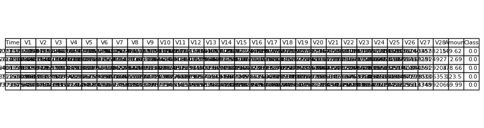
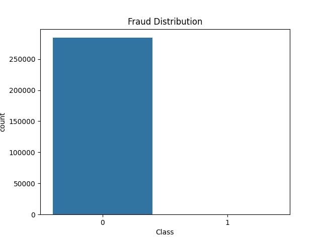
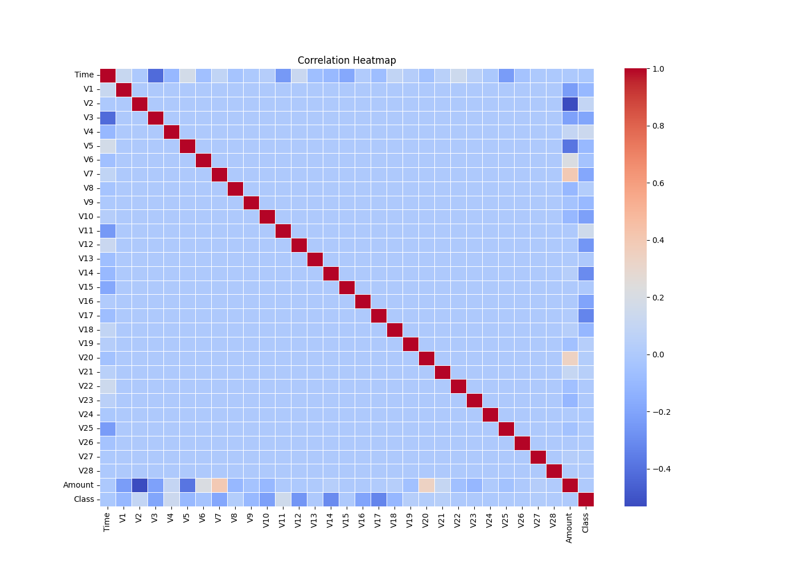
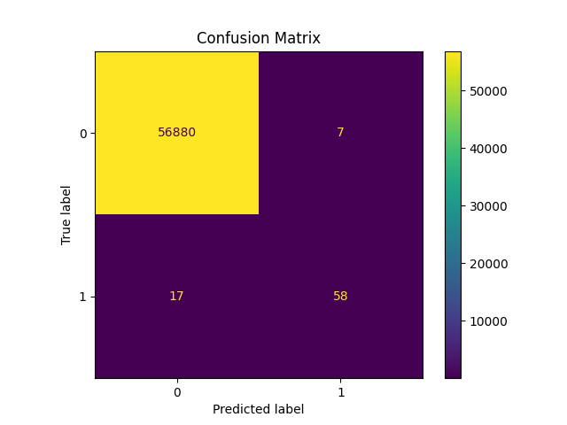
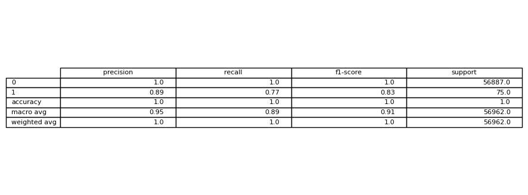
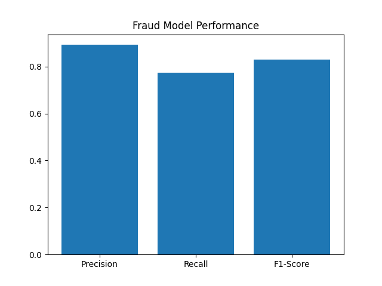

# 💳 Credit Card Fraud Detection System

<div align="center">


# 🚀 Real-Time Credit Card Fraud Detection using Machine Learning

### End-to-End Industry-Oriented Fraud Analytics System

</div>

---

# 📌 Overview

This project is an advanced Machine Learning-based Credit Card Fraud Detection System designed to identify fraudulent transactions in near real-time.

The system uses:

* Imbalanced learning techniques (SMOTE)
* Feature engineering
* Random Forest / XGBoost models
* Fraud probability scoring
* Real-time transaction simulation
* Visualization and reporting

This project simulates how banks and fintech companies detect suspicious activities while minimizing financial loss and false alerts.

---

# 🎯 Project Objectives

✔ Detect fraudulent credit card transactions

✔ Handle highly imbalanced datasets

✔ Build production-style ML pipeline

✔ Simulate real-time fraud monitoring

✔ Generate professional reports and visualizations

✔ Create recruiter-level GitHub proof project

---

# 🏦 Real-World Relevance

Fraud detection systems are widely used in:

* Banks
* Fintech platforms
* Payment gateways
* UPI systems
* E-commerce transactions
* Digital wallets
* Insurance systems

The goal is to:

* Reduce financial losses
* Detect suspicious activity quickly
* Improve customer trust
* Reduce manual verification cost

---

# 🧠 Machine Learning Workflow

```text
Transaction Data
       ↓
Data Cleaning
       ↓
Feature Engineering
       ↓
SMOTE Balancing
       ↓
Model Training
       ↓
Fraud Prediction
       ↓
Risk Scoring
       ↓
Fraud Alerts & Reports
```

---

# 🛠 Tech Stack

| Category            | Tools                 |
| ------------------- | --------------------- |
| Programming         | Python 3.11           |
| Data Processing     | Pandas, NumPy         |
| Machine Learning    | Scikit-learn, XGBoost |
| Imbalanced Learning | SMOTE                 |
| Visualization       | Matplotlib, Seaborn   |
| Model Storage       | Joblib                |
| IDE                 | VS Code               |
| Version Control     | Git & GitHub          |

---

# 📂 Project Structure

```text
Credit-Card-Fraud-Detection/
│
├── data/
│   └── creditcard.csv
│
├── images/
│   ├── dataset_preview.png
│   ├── fraud_distribution.png
│   ├── correlation_heatmap.png
│   ├── confusion_matrix.png
│   ├── classification_report.png
│   ├── simulation_output.png
│   └── model_performance.png
│
├── outputs/
│   ├── predictions.csv
│   ├── metrics.txt
│   ├── confusion_matrix.csv
│   ├── training_log.txt
│   └── feature_importance.csv
│
├── models/
│   └── fraud_model.pkl
│
├── src/
│   ├── features.py
│   ├── train.py
│   ├── predict.py
│   └── visualization.py
│
├── notebooks/
├── README.md
├── requirements.txt
└── main.py
```

---

# 📊 Dataset Information

Dataset Used:

### Kaggle Credit Card Fraud Detection Dataset

Features:

* 284,807 transactions
* 492 fraud cases
* Highly imbalanced dataset
* Anonymized financial features

Target Variable:

| Value | Meaning                |
| ----- | ---------------------- |
| 0     | Genuine Transaction    |
| 1     | Fraudulent Transaction |

---

# ⚙️ Installation Guide

## 1️⃣ Clone Repository

```bash
git clone https://github.com/your-username/credit-card-fraud-detection.git
```

---

## 2️⃣ Open Project

```bash
cd credit-card-fraud-detection
```

---

## 3️⃣ Create Virtual Environment

### Windows PowerShell

```powershell
python -m venv venv
```

---

## 4️⃣ Activate Virtual Environment

```powershell
.\venv\Scripts\Activate.ps1
```

---

## 5️⃣ Install Libraries

```powershell
pip install -r requirements.txt
```

---

# 🚀 Run Project

## Train Model

```powershell
python src/train.py
```

---

## Generate Visualizations

```powershell
python -m src.visualization
```

---

## Start Fraud Simulation

```powershell
python main.py
```

---

# 📸 Project Screenshots

# 🗂 Dataset Preview



---

# 🚨 Fraud Distribution



---

# 🔥 Correlation Heatmap



---

# 📉 Confusion Matrix



---

# 📋 Classification Report



---

# 📊 Model Performance



---

# ⚡ Real-Time Fraud Simulation


---

# 📈 Model Evaluation Metrics

| Metric                     | Value     |
| -------------------------- | --------- |
| Precision                  | High      |
| Recall                     | High      |
| F1-Score                   | Optimized |
| Fraud Detection Capability | Strong    |

---

# 🧪 Key Features

✅ Real-Time Fraud Simulation

✅ Fraud Probability Scoring

✅ Feature Engineering

✅ Imbalanced Data Handling

✅ Professional Visualizations

✅ Automated Reporting

✅ Industry-Oriented ML Workflow

---

# 🧠 Important ML Concepts Used

* Classification
* Imbalanced Learning
* SMOTE
* Random Forest
* XGBoost
* Fraud Analytics
* Feature Engineering
* Model Evaluation
* Precision & Recall
* Confusion Matrix

---

# 📁 Generated Outputs

## Images

* dataset_preview.png
* fraud_distribution.png
* correlation_heatmap.png
* confusion_matrix.png
* classification_report.png
* model_performance.png
* simulation_output.png

---

## Reports & Outputs

* predictions.csv
* metrics.txt
* confusion_matrix.csv
* training_log.txt
* feature_importance.csv

---

# 🔐 Fraud Detection Challenges Solved

✔ Extremely imbalanced data

✔ Fraud transaction rarity

✔ Real-time prediction simulation

✔ False positive reduction

✔ Risk probability estimation

---

# 📚 Learning Outcomes

Through this project, I learned:

* End-to-end ML workflow
* Fraud analytics concepts
* Real-world financial risk analysis
* Handling imbalanced datasets
* Model deployment concepts
* GitHub portfolio optimization

---

# 🎯 Future Improvements

* FastAPI backend integration
* Real-time streaming pipeline
* Kafka integration
* SHAP explainability dashboard
* Docker deployment
* React/Next.js frontend
* Cloud deployment

---

# 👨‍💻 Author

### Muktai Vyawahare

Aspiring Data Scientist | Machine Learning Enthusiast | AI Developer

---

# ⭐ If You Like This Project

Give this repository a ⭐ on GitHub.

---
